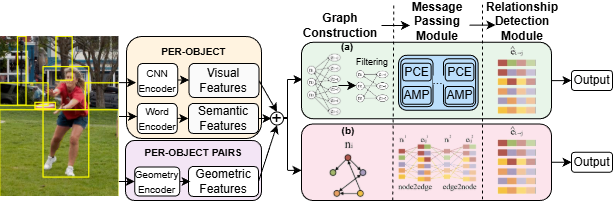

# Semantic and Structural Graph Enhancements for Scene Graph Generation

Official PyTorch implementation of **"Semantic and Structural Graph Enhancements for Scene Graph Generation"**.

This repository implements two complementary graph architectures for scene graph generation, optimized for different scene complexities.

---

## Overview

<p align="center">
  
</p>

**Figure 1**: Comparison of two scene graph generation architectures. **(a) Graph Construction**: Top shows bipartite graph with separate object and relation nodes; bottom shows homogeneous graph with objects as nodes and relationships as edges. **(b) Relationship Detection**: Top uses node-to-edge projection for bipartite; bottom uses bidirectional message passing for homogeneous.

### Dual Architecture Approach

We propose two graph-based architectures that share a common feature extraction pipeline but employ distinct message passing strategies:

#### 1. Homogeneous Object Graph (IMP)
- **Graph Structure**: Objects as nodes, relationships as edges
- **Message Passing**: Bidirectional GRU-based updates with attention weighting
- **Best For**: Moderately complex scenes (VRD dataset)
- **Complexity**: Lightweight and efficient

#### 2. Bipartite Entity-Predicate Graph (BGNN)
- **Graph Structure**: Separate entity nodes and predicate nodes
- **Message Passing**: PCE (Predicate Confidence Estimation) + AMP (Adaptive Message Passing)
  - **PCE**: Estimates confidence scores to filter unreliable relationships
  - **AMP**: Adaptively gates information flow based on predicate confidence
- **Best For**: Complex multi-object interactions (Visual Genome dataset)
- **Complexity**: Explicit relationship modeling with confidence-based gating

### Common Pipeline (Both Architectures)

Both methods follow a four-stage process:

1. **Feature Extraction**: Faster R-CNN with CNN, Word, and Geometric encoders
2. **Graph Construction**: Spatial filtering and topology initialization
3. **Message Passing**: Architecture-specific refinement (GRU+Attention for homogeneous; PCE+AMP for bipartite)
4. **Relationship Detection**: Specialized classifiers for final predictions

---

## Installation

Check [INSTALL.md](INSTALL.md) for installation instructions.

---

## Dataset

Check [DATASET.md](DATASET.md) for instructions of dataset preprocessing.

---

## Model Zoo

Performance results and pretrained models are available in [MODELZOO.md](MODELZOO.md).

**Pretrained Models:**
- [BGNN (Visual Genome)](https://shanghaitecheducn-my.sharepoint.com/:u:/g/personal/lirj2_shanghaitech_edu_cn/Ee4PdxluTphEicUDckJIfmEBisAyUgkjeuerN_rjrG1CIw?e=pgr8a5)
- [BGNN (OIv6)](https://shanghaitecheducn-my.sharepoint.com/:u:/g/personal/lirj2_shanghaitech_edu_cn/EdKOrWAOf4hMiDWbR3CgYrMB9w7ZwWul-Wc6IUSbs51Idw?e=oEEHIQ)

---

## Training

### Prepare Faster-RCNN Detector

Download the pretrained Faster R-CNN detector checkpoints:

- [VG Detector](https://shanghaitecheducn-my.sharepoint.com/:u:/g/personal/lirj2_shanghaitech_edu_cn/EQIy64T-EK9Er9y8kVCDaukB79gJwfSsEIbey9g0Xag6lg?e=wkKHJs)
- [OIv6 Detector](https://shanghaitecheducn-my.sharepoint.com/:u:/g/personal/lirj2_shanghaitech_edu_cn/EfGXxc9byEtEnYFwd0xdlYEBcUuFXBjYxNUXVGkgc-jkfQ?e=lSlqnz)
- [OIv4 Detector](https://shanghaitecheducn-my.sharepoint.com/:u:/g/personal/lirj2_shanghaitech_edu_cn/EcxwkWxBqUdLuoP58vnUyMABR2-DC33NGj13Hcnw96kuXw?e=NveDcl)

Place the checkpoint:
```bash
mkdir -p checkpoints/detection/pretrained_faster_rcnn/
# For VG dataset
mv /path/to/vg_faster_det.pth checkpoints/detection/pretrained_faster_rcnn/
```

**Important**: Update `MODEL.PRETRAINED_DETECTOR_CKPT` in `configs/e2e_relBGNN_vg-oiv6-oiv4.yaml` to point to your detector checkpoint.

### Train Scene Graph Generation Model

Training requires 4 GPUs. We provide one-click scripts in `scripts/rel_train_BGNN_[vg/oiv6/oiv4].sh`.

**Quick start:**
```bash
bash scripts/rel_train_BGNN_vg.sh
```

**Manual training:**
```bash
gpu_num=4 && python -m torch.distributed.launch --master_port 10028 --nproc_per_node=$gpu_num \
       tools/relation_train_net.py \
       --config-file "configs/e2e_relBGNN_vg.yaml" \
        DEBUG False \
        EXPERIMENT_NAME "BGNN-Bipartite" \
        SOLVER.IMS_PER_BATCH $[3*$gpu_num] \
        TEST.IMS_PER_BATCH $[$gpu_num] \
        SOLVER.VAL_PERIOD 3000 \
        SOLVER.CHECKPOINT_PERIOD 3000
```

---

## Evaluation

Use the provided test script to evaluate models:

```bash
bash scripts/rel_test.sh
```

Or manually specify the model and dataset:

```bash
python tools/relation_test_net.py \
    --config-file "configs/e2e_relBGNN_vg.yaml" \
    MODEL.WEIGHT "/path/to/checkpoint.pth" \
    DATASETS.TEST "('VG_test',)"
```

Replace `MODEL.WEIGHT` with your checkpoint path and `DATASETS.TEST` with the target dataset.

---

## Citations

This work builds upon:

```bibtex
@InProceedings{Li_2021_CVPR,
    author    = {Li, Rongjie and Zhang, Songyang and Wan, Bo and He, Xuming},
    title     = {Bipartite Graph Network With Adaptive Message Passing for Unbiased Scene Graph Generation},
    booktitle = {Proceedings of the IEEE/CVF Conference on Computer Vision and Pattern Recognition (CVPR)},
    month     = {June},
    year      = {2021},
    pages     = {11109-11119}
}
```

---

## Acknowledgments

This repository is developed on top of the scene graph benchmarking framework by [KaihuaTang](https://github.com/KaihuaTang/Scene-Graph-Benchmark.pytorch).
